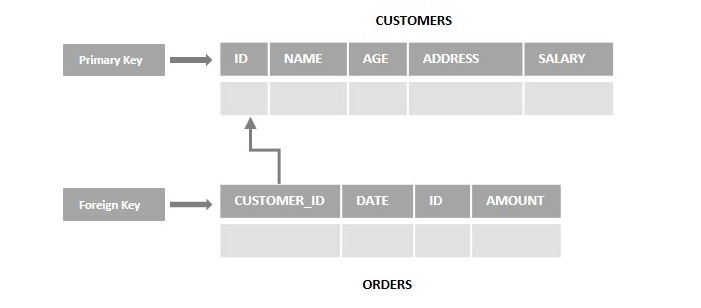

[](#)

> I'm Zaw Linn Tun a Frontend Web Developer on [Zaw Linn - Vlog](https://www.github.com/zawlinn-vlog). :heart:

<!-- #### PROJECT SIMPLE &mdash; -->

<!--  -->

<br/>

## Foreign Key ဆိုတာ ဘာလဲ ?

Table နှစ်ခု ချိတ်ဆက်မို့အတွက် Table တစ်ခုက primary key နဲ့ တွဲဖက် အသုံးပြုရသော reference key အမျိုးအစားတစ်ခုဖြစ်ပါတယ်။

<br>



<br>

1. A Foreign Key is used to reduce the redundancy (or duplicates) in the table.

2. It helps to normalize (or organize the data in a database) the data in multiple tables.

<!-- In SQL, a Foreign Key is a column in one table that matches a Primary Key in another table, allowing the two tables to be connected together. -->

<!-- A foreign key also maintains referential integrity between two tables, making it impossible to drop the table containing the primary key (preserving the connection between the tables).

The foreign key can reference the unique fields of any table in the database. The table that has the primary key is known as the parent table and the key with the foreign key is known as the child table.
Let's consider an example scenario, assume we have two tables namely CUSTOMERS (ID, NAME, AGE, ADDRES, SALARY) and ORDERS (ID, DATE, CUSTOMER_ID, AMOUNT). Here the id of the customer is primary key (ID) in the CUSTOMERS table and foreign key in the ORDERS (CUSTOMER_ID) table observe the following diagram − -->

SYNTAX &mdash;

```sql
    CREATE TABLE table_name (
    column1 datatype,
    column2 datatype,
    ...
    CONSTRAINT fk_name
	FOREIGN KEY (column_name)
	REFERENCES referenced_table(referenced_column)
    );
```

```sql
    CREATE TABLE ORDERS (
    ID INT NOT NULL,
    DATE DATETIME,
    CUSTOMER_ID INT,
    CONSTRAINT FK_CUSTOMER
    FOREIGN KEY(CUSTOMER_ID)
    REFERENCES CUSTOMERS(ID),
    AMOUNT DECIMAL,
    PRIMARY KEY (ID)
    );
```

#### ADD Foreign Key Existing table

```sql
    ALTER TABLE TABLE2
    ADD CONSTRAINT[symbol]
    FOREIGN KEY(column_name)
    REFERENCES TABLE1(column_name);
```

#### DROP FOREIGN KEY

```sql
    ALTER TABLE table_name
    DROP FOREIGN KEY (constraint symbol);
```

| Primary Key                               | Foreign Key                                      |
| ----------------------------------------- | ------------------------------------------------ |
| The primary key is always unique.         | The foreign key can be duplicated.               |
| The primary key can not be NULL.          | The Foreign can be NULL.                         |
| A table can contain only one Primary Key. | We can have more than one Foreign Key per table. |

<br>

<!--  -->

What I use packages are &mdash;

[](https://skillicons.dev)

<br>

[](#)

📫 Reach me out!

[](https://facebook.com/zawlinn.vlog)
[](https://youtube.com/@zawlinn-vlog)
[](mailto:zawlinn.profile@gmail.com)

<!-- TODO: Add last video link -->

<details>
    <summary>
        SQL - For short note
    </summary>
    <br/>

- :earth_asia: I’m currently working at @Mae Sot Market as a sale staff
- :computer: Most used line of code git commit -m "Initial Commit"
- :brain: I’m looking for help with Outstanding Video ideas.
- :mailbox_with_mail: How to reach me: zawlinn.profile@gmail.com.
- :heart: In a relationship with React
</details>
