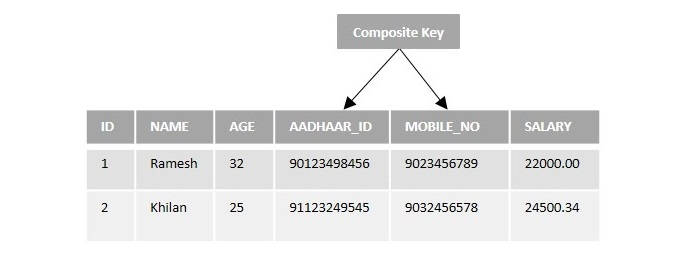
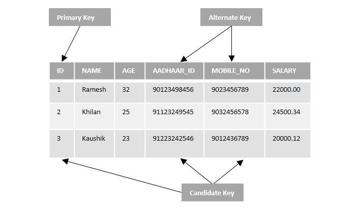

[](#)

> I'm Zaw Linn Tun a Frontend Web Developer on [Zaw Linn - Vlog](https://www.github.com/zawlinn-vlog). :heart:

<!-- #### PROJECT SIMPLE &mdash; -->

<!--  -->

<br/>

## COMPOSITE KEY

An SQL Composite Key is a key that can be defined on two or more columns in a table to uniquely identify any record. It can also be described as a Primary Key created on multiple columns.

Composite Keys are necessary in scenarios where a database table does not have a single column that can uniquely identify each row from the table. In such cases, we might need to use the combination of columns to ensure that each record in the table is distinct and identifiable.

Let us understand the composite keys with an example. Suppose if we have a table named CUSTOMERS with various fields like ID, NAME, AGE, AADHAAR_ID, MOBILE_NO and SALARY as shown below −

- A Composite Key can be created by combining more than one Candidate Key.

- Each Candidate Key (or column) that makes up a Composite Key may or may not be a Foreign Key. However, if all the columns of the Composite Key are Foreign Keys in their own right, then the Composite Key is known as a Compound Key.

  <br>

  

  <br>

- A Composite Key cannot be NULL; i.e. any column of the Composite Key must not contain NULL values.

- The individual columns making up the Composite Key can contain duplicate values, but, the combination of these columns must be unique across the database table.

```sql
    CREATE TABLE table_name(
    column1 datatype,
    column2 datatype,
    column3 datatype,
    .....
    columnN datatype,
    CONSTRAINT composite_key_name, /* placeholder */
    PRIMARY KEY(column_name)
    );
```

```sql
    CREATE TABLE CUSTOMERS(
    ID INT NOT NULL,
    NAME VARCHAR (20) NOT NULL,
    AGE INT NOT NULL,
    ADDRESS CHAR (25),
    SALARY DECIMAL (18, 2),
    CONSTRAINT ck_customers
    PRIMARY KEY (ID, NAME)
    );
```

```sql
INSERT INTO CUSTOMERS VALUES
(2, 'JOSH', 32, 'Ahmedabad', 2000.00 );

```

DROP COMPOSITE KEY

```sql
    ALTER TABLE tbname DROP PRIMARY KEY;
```

```sql
    ALTER TABLE customers DROP PRIMARY KEY;
```

## The SQL Alternate Key

SQL Alternate Keys in a database table are candidate keys that are not currently selected as a primary key. They can be used to uniquely identify a tuple(or a record) in a table.

There is no specific query or syntax to set the alternate key in a table. It is just a column that is a close second candidate which could be selected as a primary key. Hence, they are also called secondary candidate keys.

If a database table consists of only one candidate key, that is treated as the primary key of the table, then there is no alternate key in that table.
Let us understand the concept of alternate key with an example. Suppose we have a table named CUSTOMERS with various fields like ID, NAME, AGE, AADHAAR_ID, MOBILE_NO and SALARY as shown below.

<br>



<br>

- The alternate key does not allow duplicate values.

- A table can have more than one alternate keys.

- The alternate key can contain NULL values unless the NOT NULL constraint is set explicitly.

- All alternate keys can be candidate keys, but all candidate keys can not be alternate keys.

- The primary key, which is also a candidate key, can not be considered as an alternate key.

#### Candidate Key

A Candidate key is a subset of super keys that is used to uniquely identify records of a table. It can be a single field or multiple fields. The primary keys, alternate keys, foreign keys in a table are all types of candidate key.

#### Primary Key

A Primary Key is a main key that is used to retrieve records from a table. It is a single column or field in a table that uniquely identifies each record in a database table.

```sql
    CREATE TABLE table_name(
    column1 datatype,
    column2 datatype,
    column3 datatype,
    .....
    columnN datatype,
    PRIMARY KEY(column_name)
    );
```

#### Foreign Key

The Primary key of one table will be the Foreign key in another table. While inserting values into these tables, values in the primary key field must match the values in the foreign key field; otherwise, the foreign key column will not accept the INSERT query and throws an error.

```sql
    CREATE TABLE table_name (
    column1 datatype,
    column2 datatype,
    ...
    CONSTRAINT fk_name
	FOREIGN KEY (column_name)
	REFERENCES referenced_table(referenced_column)
    );
```

#### Alternate Key

An Alternate key is a candidate key that could be a primary key but is not. Like primary key, it also uniquely identifies the records in a field of a table to retrieve row tuples from the said table. There can be a single or multiple fields identifying as alternate keys in a table.

  <br>

<!--  -->

What I use packages are &mdash;

[](https://skillicons.dev)

<br>

[](#)

📫 Reach me out!

[](https://facebook.com/zawlinn.vlog)
[](https://youtube.com/@zawlinn-vlog)
[](mailto:zawlinn.profile@gmail.com)

<!-- TODO: Add last video link -->

<details>
    <summary>
        SQL - For short note
    </summary>
    <br/>

- :earth_asia: I’m currently working at @Mae Sot Market as a sale staff
- :computer: Most used line of code git commit -m "Initial Commit"
- :brain: I’m looking for help with Outstanding Video ideas.
- :mailbox_with_mail: How to reach me: zawlinn.profile@gmail.com.
- :heart: In a relationship with React
</details>
